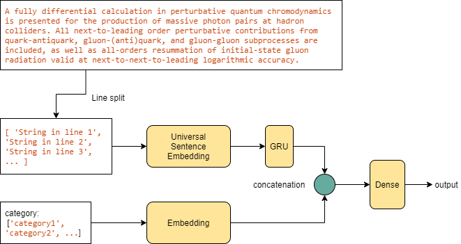

# Topic modelling v2
This is the NLP project in which I'm trying to achieve the text classification task. The main difference from [Topicmodelling v1](https://github.com/samsatp/topicmodeling) is the *method* and *data* used to train the model which will be discussed in detail in the following section.

## Method
The model will be building by employ *Zero-shot learning* idea. The model architecture can be illustrated in the figure below.
